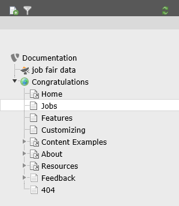

.. ==================================================
.. FOR YOUR INFORMATION
.. --------------------------------------------------
.. -*- coding: utf-8 -*- with BOM.

.. include:: ../Includes.txt

.. _admin-manual:

Administrator Manual
====================

Quick-Start
------------

- Install extension from TER and reload backend
- Create system folder "Job Fair Data". In page properties select Job Fair as container (see under behaviour).
- Use the list module to create one job in the system folder "Job Fair Data".
- Insert plugin "Job Fair" on the page where you want to display the jobs.
- Within the plugin set the "Record Storage Page" to the system folder "Job Fair Data"
- Optional: Include static template "Layout" for css based styling
- Optional: Include static template "CSS FlashMessage" for css styling of flash messages
- Optional: Include static template "Main" if you plan for different templates or use applications

Step-by-step
------------

Install from TER
^^^^^^^^^^^^^^^^

Install extension from TER and reload backend.

Create page and folder structure
^^^^^^^^^^^^^^^^^^^^^^^^^^^^^^^^
Technically, it is no problem to save all your job data sets in the same page where you insert the frontend plugin. for
reasons of clarity and comprehensibility it is however recommended, that you use a separate system folder to keep all
the data at one place. To do so, create a system folder and call it "Job Fair Data" (choose whatever you like). In the
page properties on the tab "Behaviour" set the "Contains Plugin" to "Job Fair". Be sure that the folder is not disabled
(tab "Access"). After that, create a standard page and call it "Jobs" (again, choose whatever you like). Be sure that
the folder is not disabled (tab "Access"). Now your page tree should look like this (based on introduction package):

    Page tree in introduction package just after installation of job fair

Create an example job
^^^^^^^^^^^^^^^^^^^^^
Using the list module create a new record "job" (see under "Job Fair") in the system folder "Job Fair Data". For testing
purposes just fill in the title and save the record.

Insert plugin "Job Fair"
^^^^^^^^^^^^^^^^^^^^^^^^
Using the list module create a new record on page "Jobs". On tab "Plugins" select "General Plugins". In the following
form go to tab "Plugin" and select the plugin "Job Fair". Let TYPO3 save and go to the "Behaviour" tab. Set the "Record
Storage Page" to the previously created system folder ("Job Fair Data").

Include static template
^^^^^^^^^^^^^^^^^^^^^^^
Using the template module use the button "Create extension template" to create a new template on page "Jobs". In the
dropdown on the top of the page select "Info/Modify". Click on "Edit the whole template record" and navigate to the tab
"Includes". In the section "Include static (from extensions):" select "Job Fair - Main Settings (jobfair)" and save &
close the template. Now, in the dropdown on the top of the page select "Constant Editor" and in the dropdown "Category"
select "PLUGIN.TX_JOBFAIR (6)". Fill in the name and the email of the sender for applications and save.

Include static template - CSS
^^^^^^^^^^^^^^^^^^^^^^^^^^^^^
Like described in the previous chapter you might want to include the static "Job Fair - Add Layout CSS (jobfair)". This
will give you an impression on how the forms might look like. Feel free to skip that part or copy parts of the CSS
manually from EXT:Resources/Public/Css/Additional.css. Same goes with the file FlashMessages.css and its static template.

Set record type for FE users
^^^^^^^^^^^^^^^^^^^^^^^^^^^^
If you want to use the FE user features (add, edit and delete jobs), make sure that all FE users have the record type
set to Tx_Extbase_Domain_Model_FrontendUser.

Enable Feeds
------------

After you have installed and configured the extension successfully, it is very easy to enable feeds. Using the template
editor inlude the static template "Job Fair - Add RSS Feed (jobfair)". After that, you need to set the constant
plugin.tx_jobfair.persistence.storagePid to the page UID of your folder containing the the job. After that, a new page
type is configured so that you can access the feed adding ?type=100 to the URL of you list view. Further configuration
can be done using the constant editor.
