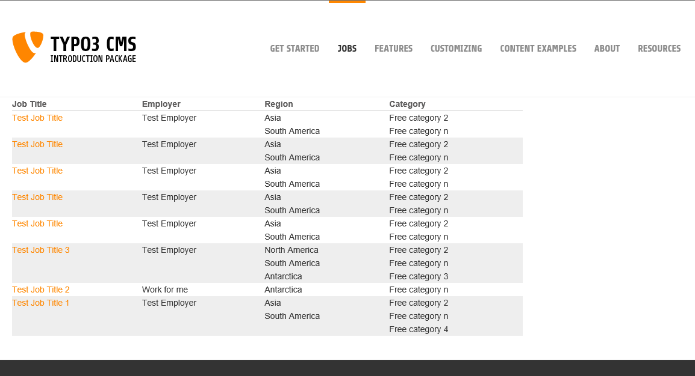
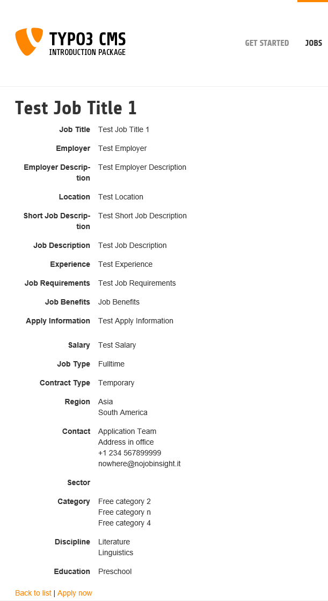
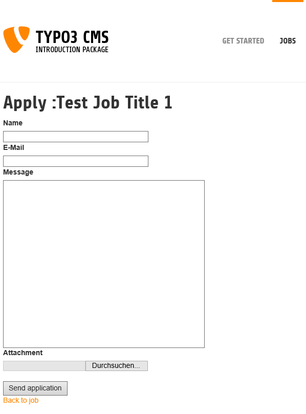
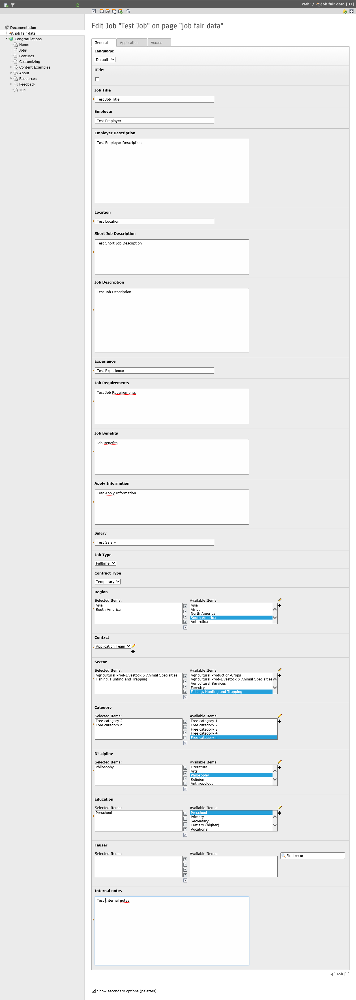

.. ==================================================
.. FOR YOUR INFORMATION
.. --------------------------------------------------
.. -*- coding: utf-8 -*- with BOM.

.. include:: ../Includes.txt

.. _introduction:

Introduction
============

.. _what-it-does:

What does it do?
----------------

This extension provides a job fair, meaning that you are able to manage job offers on you web site. Of course, there
is a simple list and detail view, but furthermore you will find the possibility to preselect and filter the output.
Visitors to your website will be able to apply directly to job offers. Logged in frontend users are able to add jobs
themselves. They also can edit and delete the jobs they created.

The whole extension is based on extbase and fluid. Therefore it is possible to adapt it to your personal needs.

The extension works like the outdated `dmmjobcontrol <http://typo3.org/extensions/repository/view/dmmjobcontrol/>`_. In
fact, the table design is same for fields already present in dmmjobcontrol.

.. _live-examples:

Live examples
-------------

`Jobs in Hessen - Das Bewerber-Portal <http://www.jobs-in-hessen.de/>`_

`Kreissportbund Rotenburg (Wümme) e.V <http://www.ksb-rotenburg.de/vereinsentwicklung/uebungsleiterboerse.html>`_

`LEWA <http://www.lewa.com/en/lewa-group/job-offers/>`_

`Made in Berlin - Messe <http://www.mib-messe.de/jobs/>`_

`Personalportal 50 plus <http://www.personalportal50plus.de/profile.html>`_

`trummer-engineering.com <http://www.trummer-engineering.com/nc/stellenmarkt/>`_

`Wiwex <http://www.wiwex.net/nc/wiwexcareers/jobboard/>`_

.. _screenshots:

Screenshots
-----------

Job list in the frontend:

    Job list in the frontend

Job details in the frontend:

    Job details in the frontend

Job application in the frontend:

   Job application in the frontend

The job record displaying all available fields (note that the MM records where created beforehand):

    Job Record
